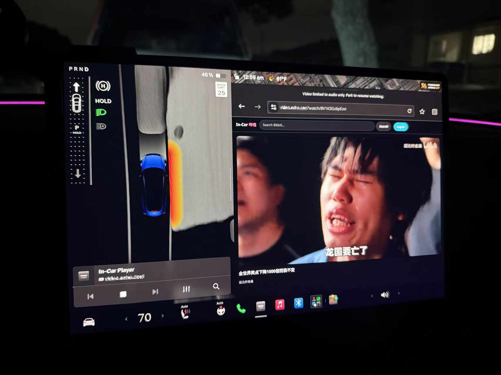

# Tesla Bilibili Player（特斯拉哔哩哔哩播放器）

[English](README.md) | **简体中文**

在**特斯拉车机浏览器**里刷 **B 站** — 登录自己的账号、看高清画质，而且**行车中画面不冻结**。

特斯拉的浏览器在车辆挂出 P 挡后会冻结/屏蔽 `<video>` 元素。本项目采用与
[tesla-player.com](https://tesla-player.com) 相同的思路绕开这一限制：完全不使用
`<video>` 元素。后端解析 B 站的 DASH 流，前端**用 WebCodecs 解封装 + 解码，把画面逐帧
绘制到 `<canvas>` 上**，音频则走 **Web Audio API**。在车机看来，这只是一个带动画的普通
网页加上应用音频 —— 不在限制范围内，因此播放不会中断。



*以 70 mph 行驶中：特斯拉弹出了"Video limited to audio only"（视频已限制为仅音频）
提示 —— 但 canvas 播放器照常播放。*

> ⚠️ **安全与使用须知。** 本项目绕过的是一项行车安全功能。请**以乘客身份**使用，
> 切勿在驾驶时观看。仅供使用自己的 B 站账号进行个人用途，使用产生的后果由你自行承担。

## 功能特性

- 🚗 **行车中持续播放** — canvas + WebCodecs 渲染，不使用 `<video>` 元素
- 📱 **扫码登录** — 用 B 站手机 App 扫描二维码即可登录，解锁推荐流、历史记录和更高画质（不登录也能看，画质上限 360p/480p）
- 🔍 **像官网一样浏览** — 推荐信息流、搜索、观看历史
- 🎚️ **画质切换**、播放/暂停、进度拖动、音量、全屏 — 全部基于 canvas 实现，不会触发行车锁定
- 🔐 **可选的站点密码** — 应用内密码门，在服务端保护 API 和视频流，而不只是挡住界面
- 🐳 **一条命令完成 HTTPS 部署** — Docker Compose 内置 Caddy，自动申请并续期 Let's Encrypt 证书

## 工作原理

```
                特斯拉车机浏览器（Chromium）
        ┌───────────────────────────────────────────┐
        │  React 应用 ──►  CanvasPlayer               │
        │                   • mp4box.js 解封装 (fMP4) │
        │                   • WebCodecs 视频解码 ─────┼──► <canvas>（没有 <video>！）
        │                   • WebCodecs 音频解码 ─────┼──► Web Audio
        └───────────────▲───────────────────────────┘
                        │ HTTPS（同源）
        ┌───────────────┴───────────────────────────┐
        │  Node/Express 后端                          │
        │   • B 站 Web API（WBI 签名）                │
        │   • 扫码登录 → 会话 Cookie                  │
        │   • 搜索 / 推荐 / 历史 / 视频信息           │
        │   • playurl → DASH（视频+音频地址）         │
        │   • /api/stream + /api/img（CDN 代理：      │
        │     补 Referer、解决 CORS、支持 Range）     │
        └─────────────────────────────────────────────┘
```

- 只使用 **AVC (H.264) 视频 + AAC 音频**轨道，因为它们在所有 Chromium 上都能通过
  WebCodecs 解码。B 站在提供 HEVC/AV1/FLAC 的同时始终会提供这两种轨道。
- 后端代理**所有**跨域字节（视频分片*和*封面图），让页面完全同源 —— 这既是因为
  B 站 CDN 校验 `Referer`，也是为了兼容跨源隔离。

## 项目结构

```
server/   Node + Express + TypeScript 后端（B 站 API、WBI 签名、流代理）
web/      React + Vite + TypeScript 前端（浏览界面 + canvas 播放器）
Dockerfile、docker-compose*.yml、Caddyfile   部署相关
```

## 环境要求

- 本地开发需要 Node.js 20+（推荐 22），部署可用 Docker。
- 一台车机可以通过 **HTTPS** 访问到的服务器（见[部署](#部署docker--vps)）。
- 一个 B 站账号（可选 —— 不登录也能浏览，但画质上限 360p/480p）。

---

## 本地开发

在两个终端里分别运行后端和 Vite 开发服务器：

```bash
# 终端 1 —— 后端，端口 :8080
cd server
npm install
npm run dev

# 终端 2 —— 前端，端口 :5173（/api 请求代理到 :8080）
cd web
npm install
npm run dev
```

打开 http://localhost:5173。注意：**WebCodecs 需要 Chromium 内核浏览器**
（Chrome/Edge）；桌面版 Firefox/Safari 无法播放。

## 生产构建（单进程）

后端会直接托管构建好的前端，所以只需要跑一个进程：

```bash
cd web && npm install && npm run build      # 输出到 web/dist
cd ../server && npm install && npm start     # 在 :8080 同时提供 API + web/dist
```

打开 http://localhost:8080。

---

## 部署（Docker → VPS）

```bash
# 构建 + 运行
docker compose up -d --build
# 应用运行在 :8080
```

或者直接用 Docker：

```bash
docker build -t tesla-bili-player .
docker run -d -p 8080:8080 -e SESSION_SECRET=$(openssl rand -hex 32) tesla-bili-player
```

### 必须使用 HTTPS

播放器依赖 **WebCodecs**，浏览器只在**安全上下文**（HTTPS 或 `localhost`）中提供该
API。用纯 HTTP 访问会静默失败 —— 视频永远播不出来。特斯拉浏览器本身也要求 HTTPS，
所以正式部署必须上 HTTPS。

#### 一键 HTTPS：`docker-compose.https.yml`（推荐）

内置一个 **Caddy** 反向代理，自动申请并续期 Let's Encrypt 证书。在目标服务器上：

```bash
# 1. 把你的域名 DNS A/AAAA 记录指向这台服务器，开放 80 和 443 端口。
# 2. 配置：
cp .env.example .env         # 设置 DOMAIN、ACME_EMAIL
echo "SESSION_SECRET=$(openssl rand -hex 32)" >> .env
# 3. 启动：
docker compose -f docker-compose.https.yml up -d --build
```

然后访问 `https://<你的域名>`（首次访问需等待约 10 秒签发证书）。只有 Caddy 的
80/443 端口对外开放，应用本身不暴露。

#### 给站点加密码（可选）

设置 `SITE_PASSWORD` 后，任何人浏览或观看前都会先看到一个页面内的密码输入界面
（通过签名 Cookie 记住登录状态）。这是应用内登录 —— 不是浏览器的 Basic Auth
弹窗 —— 因此在特斯拉浏览器里工作可靠。

```bash
echo "SITE_PASSWORD=your-password-here" >> .env
docker compose -f docker-compose.https.yml up -d
```

所有数据和流媒体接口（`/api/*`）都在服务端校验，所以密码真正保护的是播放本身，
而不只是界面。留空 `SITE_PASSWORD` 则开放访问。

#### 服务器上已有反向代理？（80/443 被占用）

如果服务器已经在为其他服务终结 TLS，就不要再跑内置的 Caddy（会报
`bind: address already in use`）。只运行应用本体，然后在现有代理上加一个虚拟主机：

```bash
echo "SESSION_SECRET=$(openssl rand -hex 32)" > .env
docker compose -f docker-compose.behind-proxy.yml up -d --build   # 应用监听 127.0.0.1:8080
```

已有 **Caddy**：

```
player.example.com {
    reverse_proxy 127.0.0.1:8080
}
```

已有 **Nginx**（放在你的 `server { listen 443 ssl; server_name player.example.com; … }` 里）：

```
location / {
    proxy_pass http://127.0.0.1:8080;
    proxy_set_header Host $host;
    proxy_set_header X-Forwarded-For $remote_addr;
    proxy_set_header X-Forwarded-Proto https;
}
```

#### 其他方案

- **Cloudflare Tunnel** —— 无需开放端口；把一个域名映射到 `http://localhost:8080`。
  快速测试：`cloudflared tunnel --url http://localhost:8080`。

### 环境变量

| 变量                | 默认值             | 用途                                                            |
| ------------------- | ------------------ | --------------------------------------------------------------- |
| `PORT`              | `8080`             | 监听端口                                                        |
| `SESSION_SECRET`    | 开发用密钥         | **生产环境务必设为长随机字符串**（Cookie 签名）                 |
| `SITE_PASSWORD`     | *(空)*             | 可选的应用内密码门；留空 = 开放访问                             |
| `COEP`              | `require-corp`     | 跨源隔离模式：`require-corp` / `credentialless` / `off`（compose 文件默认 `off`） |
| `LOG_LEVEL`         | `info`             | 日志级别：`debug` / `info` / `warn` / `error`                   |
| `BILI_UA`           | Chrome UA          | 请求 B 站时使用的 User-Agent                                    |
| `STREAM_HOST_ALLOW` | B 站 CDN 域名      | 流代理的 SSRF 白名单（域名后缀）                                |
| `IMG_HOST_ALLOW`    | B 站图片域名       | 图片代理的 SSRF 白名单（域名后缀）                              |
| `WEB_DIST`          | `../web/dist`      | 前端构建产物路径                                                |

本播放器其实不需要 `COEP`（WebCodecs 不使用 SharedArrayBuffer），而且所有资源都已
代理为同源，开关均无影响；如果车机浏览器有异常，设 `COEP=off` 即可。

---

## 在车里使用

1. 在特斯拉浏览器中打开你的 HTTPS 地址（建议加入书签）。
2. **登录**（右上角）—— 页面会显示二维码，用 B 站手机 App 扫码确认。登录后解锁
   推荐流、观看历史和更高画质。（不登录也可以浏览。）
3. 从**推荐**信息流、**历史记录**或**搜索**中挑一个视频。
4. 在观看页里视频通过 canvas 播放器播放。**先点一下画面开始播放**
   （浏览器要求有用户点击后才允许播放声音）。

**操作：** 点按播放/暂停 · 进度条拖动 · 音量 · 画质按钮（在播放器下方，登录后解锁
更高画质）· 全屏（⛶）。因为是 canvas，这些操作都不会触发行车锁定。

---

## 限制与说明

- **仅支持 Chromium** —— 依赖 WebCodecs（`VideoDecoder`/`AudioDecoder`）。特斯拉浏览器
  是 Chromium 内核所以没问题；桌面版 Firefox/Safari 不行。
- 目前**只支持 AVC + AAC**。HEVC/AV1/FLAC 轨道会被忽略（WebCodecs 对它们的支持不
  一致）。普通 B 站视频都能正常播放。
- **不支持 DRM。** 普通用户投稿没问题；DRM 保护的内容无法播放。
- **会话保存在内存中** —— 后端重启后需要重新扫码登录。如需持久化，可替换
  `server/src/bili/session.ts` 中的存储实现。
- 拖动到新位置后**需要一两秒重新缓冲**。
- 本项目非官方，使用的是 B 站 Web API；接口和签名方式可能随时间变化。

## 路线图

- 通过 `yt-dlp` 提取器支持 YouTube（复用同一个 canvas 播放器）。
- 在浏览器支持的情况下播放 HEVC/AV1。
- 会话持久化；多用户支持。

## 许可证

[PolyForm Noncommercial 1.0.0](LICENSE) —— 允许出于任何**非商业**目的自由使用、
修改和分发本项目；不允许商业使用。

> Required Notice: Copyright (c) 2026 Yuyang Wang

## 免责声明

本项目与特斯拉（Tesla）和哔哩哔哩（Bilibili）均无关联。它以与官网相同的方式、
使用你自己的账号调用 B 站公开的 Web API。内容版权归原作者所有，请勿用于转播或
分发视频流。注意行车安全。
